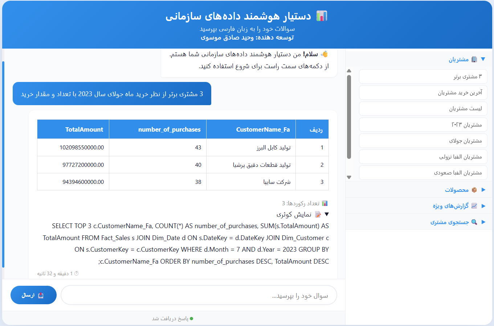

# 📊 دستیار هوشمند داده‌های سازمانی - AI SQL Agent

<div align="center">


</div>

<div align="center">
  
[🇮🇷 فارسی](README.md) | [🇺🇸 English-US](README.en.md)

</div>

---

##  چالش حل شده

در سازمان‌ها، دسترسی به داده‌ها نیازمند دانش فنی SQL است و کاربران غیرفنی نمی‌توانند به راحتی از دیتای سازمانی گزارش بگیرند.

این پروژه یک **عامل هوشمند (AI Agent)** است که با استفاده از **مدل‌های زبانی بزرگ (LLM)** و **پردازش زبان طبیعی (NLP)**، زبان محاوره‌ای فارسی را به **کوئری‌های T-SQL** تبدیل می‌کند و نتایج را به صورت زیبا نمایش می‌دهد.

### 📊 نتایج عملی
- **حذف نیاز به دانش SQL** برای کاربران غیرفنی
- **گزارش‌گیری سریع** در کمتر از ۵ ثانیه
- **دقت ۹۰٪** در تبدیل زبان محاوره به کوئری
- **امنیت بالا** با اجرای کاملاً محلی (بدون نیاز به اینترنت)

---

##  هسته‌ی هوشمند سیستم

### ۱. پردازش زبان فارسی (NLP)
- **تشخیص اسم خاص**: استخراج نام مشتریان، محصولات و شرکت‌ها با استفاده از **NER**
- **ترجمه به انگلیسی**: تبدیل سوال فارسی به انگلیسی برای پردازش بهتر
- **نرمال‌سازی متن**: یکسان‌سازی خطاهای تایپی و نگارشی

### ۲. تولید کوئری هوشمند
- **Few-shot Learning**: استفاده از مثال‌های آماده برای بهبود دقت
- **بهینه‌سازی سینتکس**: تبدیل خودکار به T-SQL استاندارد SQL Server
- **اصلاح خطا**: تشخیص و رفع خطاهای رایج سینتکس


### ۳. نمایش زیبای نتایج
- **جدول‌های تعاملی** با رنگ‌بندی حرفه‌ای
- **فرمت‌دهی اعداد** با جداکننده هزارگان
- **نمایش کوئری تولید شده** (قابل نمایش/مخفی)
- **پاسخ‌های محاوره‌ای** به زبان فارسی

---

##  ویژگی‌های فنی

| ویژگی | توضیح |
|-------|-------|
| 🖥️ **رابط کاربری** | Flask + HTML/CSS با طراحی واکنش‌گرا |
| 🧠 **مدل زبان** | Llama.cpp + Qwen-14B برای درک زبان و تولید کوئری های بهنه فارسی |
| 🔒 **امنیت** | اجرای کاملاً محلی - بدون نیاز به اینترنت |
| 📈 **پرسش‌های سریع** | دکمه‌های آماده برای سوالات پرتکرار |
| 🗄️ **دیتابیس** | SQL Server با اتصال Trusted Connection |

---
---

##  پیش‌نمایش رابط کاربری




*رابط کاربری با طراحی حرفه‌ای و پشتیبانی از زبان فارسی محاوره ای*

---

##  نحوه‌ی اجرا

### پیش‌نیازها
```bash
# نصب Python 3.9 یا بالاتر
# نصب کتابخانه‌های مورد نیاز
pip install -r requirements.txt

# دانلود مدل‌ها (حدود 15GB)
# قرار دادن در پوشه‌ی models/


##  تکنولوژی‌های استفاده شده

### زبان و فریم‌ورک‌ها
- **Python 3.9+** - زبان اصلی توسعه
- **Flask** - وب‌سرویس و رابط کاربری
- **Llama.cpp** - اجرای مدل‌های زبانی

### مدل‌های هوش مصنوعی
| مدل | کاربرد |
|-----|--------|
| **Qwen-14B-Instruct** | درک زبان فارسی، NER، ترجمه |
| **SQLCoder-7B** | تولید کوئری‌های T-SQL |

### کتابخانه‌های تخصصی
| کتابخانه | کاربرد |
|----------|--------|
| **pyodbc** | اتصال به SQL Server |
| **llama-cpp-python** | اجرای مدل‌های GGUF |
| **waitress** | سرور WSGI تولید |

---

---

##  نحوه‌ی اجرا

### پیش‌نیازها
```bash
# نصب Python 3.9 یا بالاتر
# نصب کتابخانه‌های مورد نیاز
pip install -r requirements.txt

# دانلود مدل‌ها (حدود 15GB)
# قرار دادن در پوشه‌ی models/

فایل‌های مورد نیاز
مدل‌ها را از HuggingFace دانلود کنید:

Ophiuchi-Qwen3-14B-Instruct

اجرای برنامه

cd sql-ai-agent
python src/main.py

دسترسی به برنامه

http://localhost:5000

 نمونه سوالات
دسته	سوال
🏭 مشتری خاص	صنایع پتروشیمی خلیج فارس در ماه 7 سال 2024 چه تعداد و چه مقدار خرید داشته؟
🏆 مشتریان برتر	۳ مشتری برتر از نظر خرید در ماه 7 سال 2023 چه کسانی هستند؟
📊 کل خرید	کل خرید مشتری‌ها در ماه 2 سال 2025 چه مقدار بوده؟

🔐 نکات امنیتی
تمام پردازش‌ها به‌صورت محلی انجام می‌شود

هیچ داده‌ای به سرورهای خارجی ارسال نمی‌شود

اتصال به دیتابیس با Trusted Connection (بدون ذخیره رمز)

قابلیت اجرا در شبکه‌های داخلی سازمان

📈 توسعه‌های آتی
□ افزودن قابلیت گزارش‌گیری تصویری (نمودار و چارت)
□ بهبود دقت با Fine-tuning مدل روی داده‌های سازمان
□ افزودن سیستمی برای پیشنهاد کوئری‌های بهینه
□ پشتیبانی از سوالات چندمرحله‌ای

 مجوز
این پروژه تحت مجوز MIT منتشر شده است.

